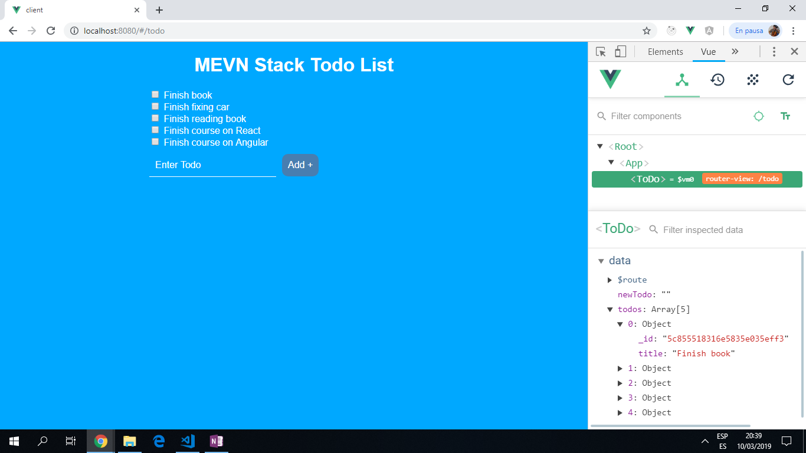
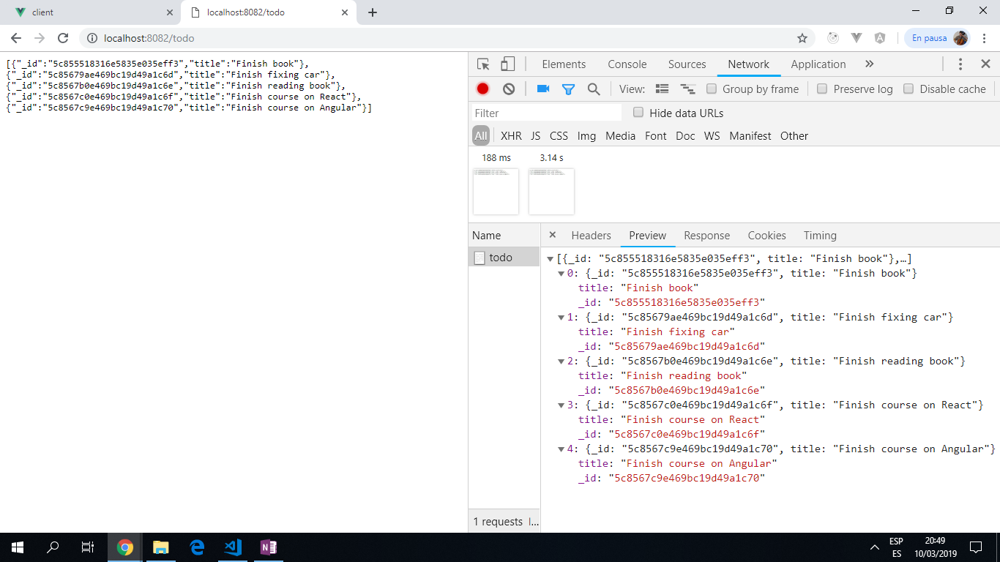

# MEVN ToDo App

A MEVN Full-stack todo app using MongoDB, Express.js, Vue and Node.js.

**Note: to open web links in a new window use: _ctrl+click on link_**

## Table of contents

* [General info](#general-info)
* [Screenshots](#screenshots)
* [Technologies](#technologies)
* [Setup](#setup)
* [Features](#features)
* [Status](#status)
* [Inspiration](#inspiration)
* [Contact](#contact)

## General info

The project is a MEVN full stack, so it has 2 separate parts: a client-side for the frontend Vue framework and a server-side for the backend calls.

The MongoDB database runs on [Mongo Atlas](https://cloud.mongodb.com/user#/atlas/login), collection name 'test'. This collection is accessed from the backend Node server file './src/app.js'. [Axios](https://www.npmjs.com/package/axios) is used to push Todo inputs to the server app.js file then [mongodb](https://www.mongodb.com/) is used to write the data to the database.

## Screenshots




## Technologies

* [MongoDB Atlas](https://www.mongodb.com/) using AWS Cloud storage.
* [Express v4.17.1](https://www.npmjs.com/package/express)
* [Vue v2.6.10](https://vuejs.org/)
* [Node.js v12.3.1](https://nodejs.org/en/)

## Setup
First fork or clone the repo into your local machine!
Then npm install into cloned folder, this will install the necessary dependencies, then navigate into te client folder.
* To start the Vue frontend:
In the Client directory install dependencies using "npm install", then run frontend using "npm run dev".

* To start the Node.js backend:
In the Server directory install dependencies using "npm install", then run backend using "npm start".

## Code Examples

* Example of Backend code:

```javascript
`// define route to get todos
app.get('/todo', (req, res) => {
  const collection = client.db("test").collection("todos");
  collection.find().toArray(function (err, results) {
    if (err) {
      console.log(err);
      res.send([]);
      return;
    }
    res.send(results);
  })
})
const port = 8082
app.listen(process.env.PORT || port) // client is already running on 8080`

```

* Example of Frontend code:

```javascript
import ToDoAPI from '@/services/ToDoAPI.js'

// data object returns existing Todo list then lifecycle hook 'mounted' used to show Todos
export default {
  data () {
    return {
      newTodo: '',
      todos: []
    }
  },
  mounted () {
    this.loadTodos()
  },
  methods: {
    async addTodo (evt) {
      evt.preventDefault() // prevents the form's default action from redirecting the page
      const response = await ToDoAPI.addTodo(this.newTodo)
      this.todos.push(response.data)
      this.newTodo = '' // clear the input field
    },
    deleteTodo (todoID) {
      ToDoAPI.deleteTodo(todoID)
      // remove the array element with the matching id
      this.todos = this.todos.filter(function (obj) {
        return obj._id !== todoID
      })
    },
    async loadTodos () {
      const response = await ToDoAPI.getToDos()
      this.todos = response.data
    }
  }
}

```

## Features

* Working Todo list - frontend and backend fully functional.

## To-do list

1. Improve frontend UI - change checkboxes to buttons.

2. Add a date field to Backend database.

## App Status

Working basic Vue frontend and MongoDB backend.

## Inspiration

App created using Medium articles by Matt Maribojoc "Creating a ToDo App with a MEVN Full Stack": [Part 1](https://medium.com/@mattmaribojoc/creating-a-todo-app-with-a-mevn-full-stack-part-1-da0f4df7e15) & [Part 2](https://medium.com/@mattmaribojoc/creating-a-todo-app-with-a-mevn-full-stack-part-2-8180d944233a).

## Contact

Repo created by [ABateman](https://www.andrewbateman.org) - feel free to contact me!
